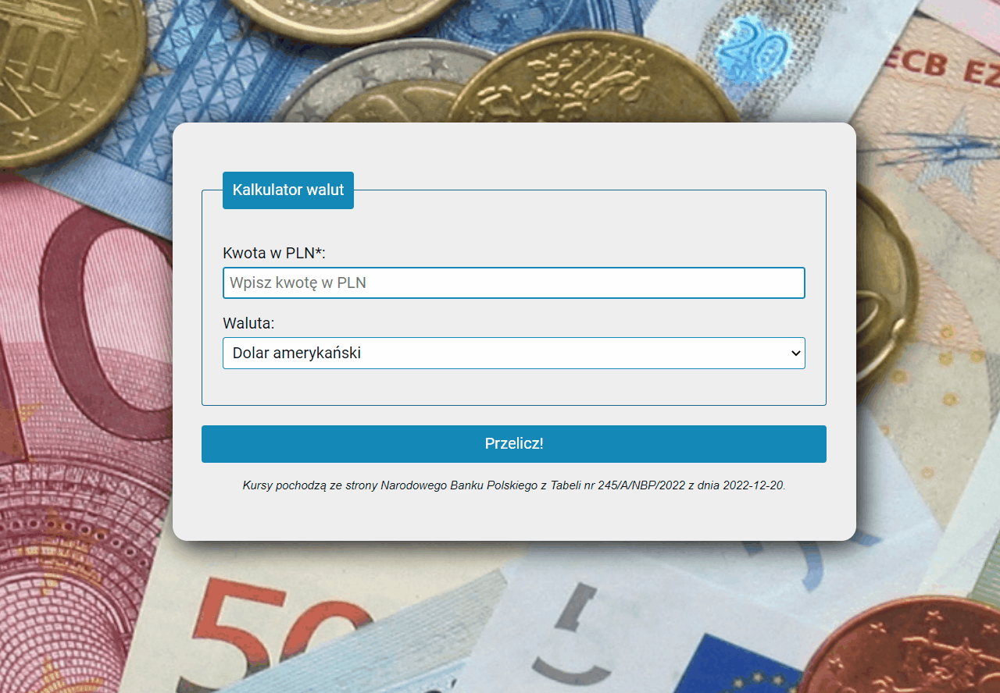

# *Currency converter*

## Demo

https://michalszustkiewicz.github.io/currency-converter/

## Description

This simple application has been created as a part of the project carried out at [YouCode](https://youcode.pl/) programming school. You may use it e.g. to check how much money you will get if you want to exchange from polish "zloty" (PLN) to some other common currencies. Returned values are based on data obtained from the Polish National Bank on 20.12.2022.

In order to use the application, please type in the first field ("Kwota w PLN*) the amount of money in PLN. Then choose one from seven available currencies in the second field ("Waluta"). To receive the result click "Przelicz!" (demonstration below).

## Languages and technologies

- HTML
- CSS (BEM, Flex Box)
- JavaScript (ES6+)
